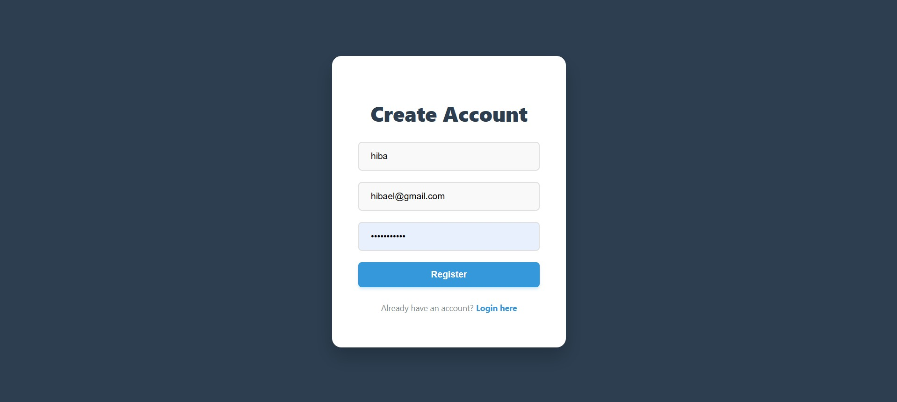
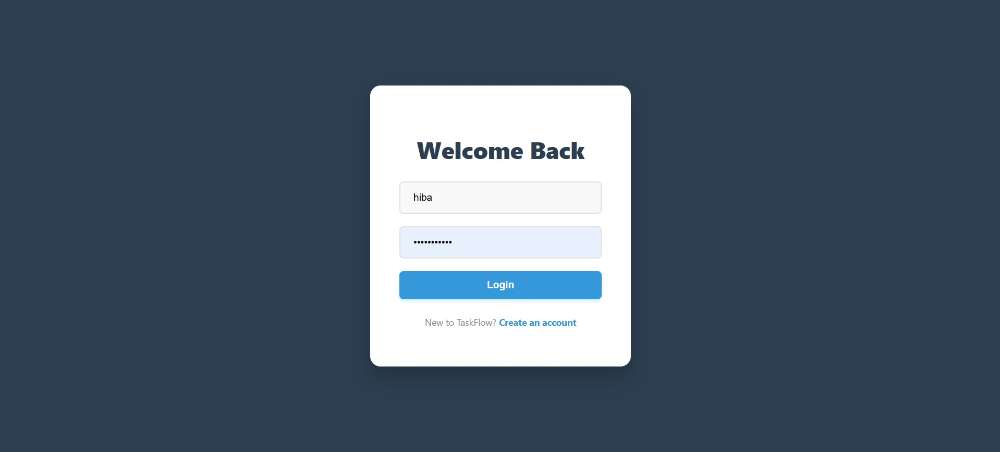
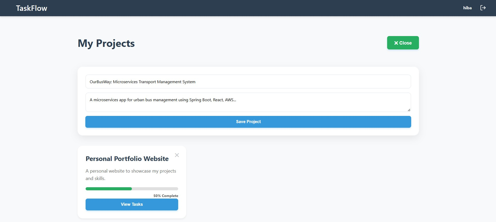
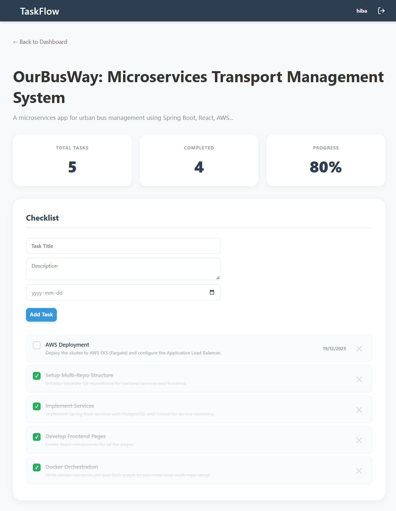
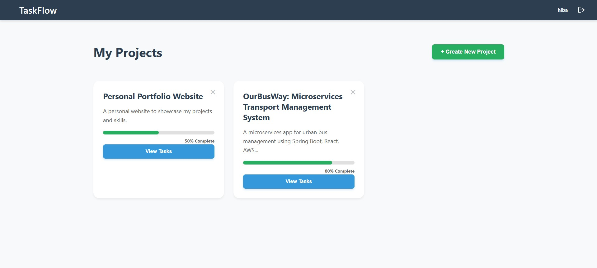
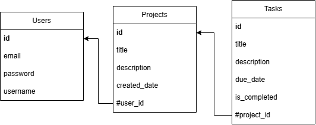

# 📝 TaskFlow

TaskFlow is a full-stack project tasks management application designed to help users organize projects, track progress, and manage tasks with a simple, modern user interface.

## 📸 Interface & Features






### **Key Functionalities**
- **🔐 User Authentication**: Secure Login and Registration using JWT.
- **📊 Project Dashboard**: Create, view, and delete projects.
- **✅ Task Management**: 
  - Add tasks with **titles**, **descriptions**, and **due dates**.
  - Toggle task completion status.
  - Delete unwanted tasks.
- **📈 Visual Progress**: Progress bars automatically update as tasks are completed.

---

## Database Architecture

The application is built on a relational database model linking **Users**, **Projects**, and **Tasks**.



- **Users 1:N Projects** (A user can have many projects)
- **Projects 1:N Tasks** (A project can have many tasks)

---

## 🚀 Technologies Used

### Backend (API)
- **Java** (JDK 17+)
- **Spring Boot** (Web, Data JPA, Security)
- **PostgreSQL** (Database)
- **Hibernate** (ORM)
- **JWT** (JSON Web Tokens)

### Frontend (Client)
- **React.js** (Vite)
- **React Router** (Navigation)
- **Axios** (HTTP Client)
- **Custom CSS** (Responsive UI)

---

## ⚙️ Installation & Setup

### 1. Database Configuration
The application uses **PostgreSQL** version 16, or you can use a compatible version. You do not need to manually create tables; the app handles this automatically.

1. **Create the Database**:
   ```sql
   CREATE DATABASE taskflow;
   ```
2. **Configure settings**: Open backend/src/main/resources/application.properties and update it to match your PostgreSQL local settings:
 ```Bash
spring.datasource.url=jdbc:postgresql://localhost:5432/taskflow
spring.datasource.username=postgres
spring.datasource.password=YOUR_DB_PASSWORD
spring.jpa.hibernate.ddl-auto=update
 ```

### 2. Backend Setup (Spring Boot + Intellij IDEA)
1. **Navigate to the backend directory:**
```Bash
cd backend
```
2. **Run the application:**
```Bash
./mvnw spring-boot:run
```
3. The server will start on http://localhost:8080.

### 3. Frontend Setup (React + VSCode)
1. **Open a new terminal and navigate to the frontend:**
```Bash
cd frontend
```
2. **Install dependencies:**
```Bash
npm install
```
3. **Start the development server:**
```Bash
npm run dev
npm install axios react-router-dom
```
4. Open your browser to the link shown in your terminal, usually: http://localhost:5173.
